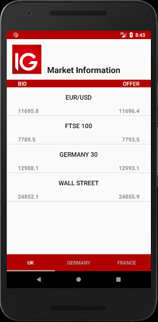
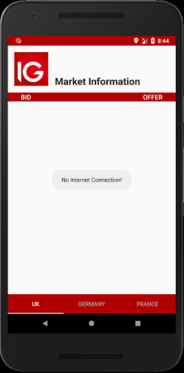
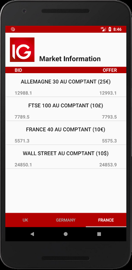

IGmarketApp
===================================

This is an app prepared for the recruitment process in IG company. App connects with the provided API, retriving three information: bid, offer and name of the instrument and shows them in a single record. Each record is presented in different object of the ArrayList that is using modified ArrayAdapter to display and recycle views on the xml layout. To navigate between different countries I used fragments, where one adapter generates three different fragments via 3 different API links and Loaders. Countries' names are presented in a separated tabs through tabLayout. For the xml layout files I used the constraintLayout containers. If there is no internet connection a toast message appears, with the information for user.

If you want to see the app in action, please follow this link: https://tr0lczyk.tinytake.com/sf/MjYyMTE5NV83ODgyNjM3

The application looks like that:

Purpose of this project is non-commercial. If you are an owner of ip that believes your property has been improperly used, please let me know.
